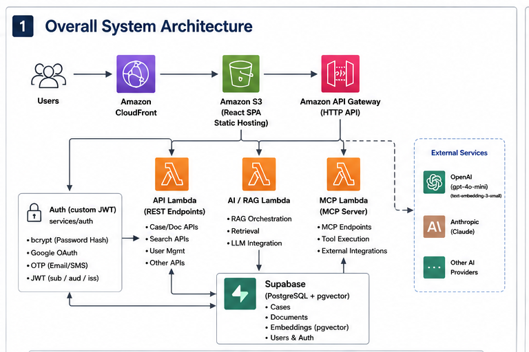

# ProBono AI

Semantic search and RAG-powered legal Q&A over NSW legislation and caselaw — serverless, MCP-native, built for non-lawyers who can't afford counsel.

**Live demo:** https://www.probonoai.com.au — Guest: `demo` / `demo1234`

---

## Architecture



📐 More diagrams (RAG retrieval flow, document ingestion pipeline, MCP + AI): **[docs/ARCHITECTURE.md](docs/ARCHITECTURE.md)**.

**One API Gateway, four Lambdas.** Routes split at the gateway — `/search /ask /chat` → AI Lambda, everything else → API Lambda — so auth stays lean and independent of the heavier RAG stack. No extra cost vs. a single `$default` Lambda. (Real package sizes and cold starts are in the *Lambda package size & cold start* section below.)

---

## Quick Start

```bash
cp .env.example .env                    # set OPENAI_API_KEY, DATABASE_URL, JWT_SECRET
psql $DATABASE_URL -f schema.sql
pip install -r requirements.txt

python -m services.api.main             # → localhost:20000  (auth, intake, conversations)
python -m services.ai.main              # → localhost:20003  (search, ask, chat)
cd frontend && npm install && npm run dev  # → localhost:20001
```

---

<details>
<summary><strong>System Design Decisions</strong></summary>

### Why pgvector instead of Pinecone/Weaviate?

The corpus is already in PostgreSQL. A separate vector store means a second service, a sync job, and an extra network hop on every query. pgvector HNSW gives sub-10ms retrieval at this scale. The tradeoff: pgvector doesn't autoscale independently of Postgres — at high write throughput the index rebuild cost matters. Not a concern at demo scale.

### Why Lambda instead of ECS?

Request volume is bursty and demo-scale. Lambda costs zero at rest, Mangum means the same FastAPI code runs locally and on Lambda with no changes, and cold starts are under 3s even for the 50MB AI Lambda. ECS is warranted at sustained load (>100 req/min sustained), because the per-request cost inverts.

### Why split the Lambda into API + AI?

The AI Lambda carries LangChain + the OpenAI SDK; the API Lambda is pure FastAPI with no ML deps. Auth calls (login, refresh, MCP token) should never wait behind the AI Lambda's heavier init, so splitting keeps auth lean and independent. Real package sizes after the de-bloat below: **API 13.6 MB, AI 29.3 MB**.

### Lambda package size & cold start

The four zips were shipping weight they never needed. `boto3`/`botocore` (~21 MB) are already in the Lambda Python runtime, and `uvicorn[standard]`'s async extras (uvloop/httptools/watchfiles, ~20 MB) are local-dev only — under Mangum the app never touches them. Stripping both (`slim()` in `build_lambda.sh` + plain `uvicorn`):

| Lambda | Before | After |
|---|---|---|
| API    | 41.6 MB | **13.6 MB** |
| AI     | 67.5 MB | **29.3 MB** |
| MCP    | 67.5 MB | **29.3 MB** |
| Ingest | 62.6 MB | **39.6 MB** |

**What size bought — and didn't.** Faster deploys and a genuinely lean auth Lambda. But cold start barely moved (API ~3.0s → ~2.9s): cold start here is **import-bound, not size-bound** — the time goes into importing `cryptography`/`pydantic`/`psycopg2`/`fastapi`, not downloading the zip. The real levers are more memory (more CPU → faster imports) and Lambda **SnapStart**.

**On SnapStart — considered, deliberately deferred.** SnapStart snapshots the post-init environment and restores it in ~200–500 ms, which would erase most of this cold start since the imports are already done (GA for Python 3.12+). It's not adopted here because at this scale it's overkill and carries real caveats worth knowing: it needs a published-version + alias deploy model (API Gateway points at the alias), snapshot caching/restore isn't free for Python, and anything unique-per-instance must be re-initialized in an `after_restore` hook. Notably the OTP generator would have to move off `random.randint` first — a shared, snapshotted RNG state would make codes predictable across restored instances. Being able to reason about that tradeoff matters more than flipping the switch; SnapStart earns its complexity once cold start is a measured UX problem, not before.

### Why presigned S3 PUT for document uploads?

Lambda has a 6MB payload limit on request bodies. A 25MB PDF would be rejected at the gateway before the Lambda even runs. Presigned PUT lets the browser upload directly to S3 — Lambda only generates the short-lived URL (1 hour TTL). The Lambda never touches the file bytes during upload.

### Why the same embedding model everywhere?

All tables use `text-embedding-3-small` at 1536 dims. If you swap embedding models, all existing vectors become incomparable — you have to re-embed every row in every table. The constraint is: pick one model and hold it. Changing it is a migration event, not a config change.

### Why LangChain LCEL?

`|` composition makes the retrieval → prompt → LLM → parser chain readable and makes swapping components trivially safe (different retriever, different LLM, different prompt — each is one substitution). The tradeoff: LangChain is a heavy dependency (~30MB) and the abstraction sometimes hides what's actually happening. Acceptable here because this is the core product loop.

### Why MCP for AI client integration?

The RAG tools have typed inputs and string outputs — exactly what MCP expects. Exposing them over MCP means Claude Desktop, Cursor, and any future MCP client can query the same data without building a custom integration. The `/connect` page gives users a self-service token flow.

### Why static SPA (Vite + React Router) instead of Next.js SSR?

The app has no server-rendered pages — everything is auth-gated client-side fetch. Next.js SSR was never used; the app ran in `output: 'export'` mode (pure static). Vite gives faster dev builds, a simpler mental model, and removes the Next.js-specific conventions that added friction. The tradeoff: no incremental static regeneration, no server components, no edge middleware — none of which this app needs.

</details>

---

<details>
<summary><strong>IAM & Security</strong></summary>

### What's working

**GitHub Actions OIDC** — keyless auth. No long-lived CI secrets. The role is scoped by subject claim:
```
token.actions.githubusercontent.com:sub = repo:jaechung-dev/probonoai:*
```
Even if the OIDC token is intercepted, it's short-lived and scoped to this repo only.

**S3 presigned PUTs are time-boxed** — 1-hour TTL. The browser gets a signed URL, uploads directly, and the URL expires. Lambda never holds file bytes.

**Refresh token rotation** — single-use sliding window. Each refresh call exchanges the current token for a new one. Stolen token replay fails after the first legitimate use.

**MCP tokens are hashed** — stored as SHA-256 in `mcp_tokens`, not plaintext. A DB read doesn't expose the token.

**Least-privilege IAM** — four separate Lambda execution roles (`api`, `ai`, `mcp`, `ingest`), each granted only what it needs. SES is scoped to the app's domain identity; ingest-only permissions (S3 read, SQS consume, Textract) never touch the auth path.

**Secrets in AWS Secrets Manager** — `DATABASE_URL`, `JWT_SECRET`, `OPENAI_API_KEY`, and OAuth secrets are fetched at cold start via `SECRET_ARN`, never stored in Lambda env vars or terraform state.

**Private Lambda artifact bucket** — deployment zips live in a dedicated private bucket, separate from the public frontend/CloudFront bucket.

</details>

---

<details>
<summary><strong>Auth Token Architecture</strong></summary>

### What we issue

| Token type | Format | Storage | TTL | Purpose |
|---|---|---|---|---|
| Access token | JWT HS256 | Client-side (memory/localStorage) | 15 min | Authenticate API calls |
| Refresh token | `opaque-uuid` | DB (SHA-256 hashed) | 7 days | Rotate access tokens |
| MCP token | `mcp-<uuid>` | DB (SHA-256 hashed) | No expiry | Long-lived tool access |
| OTP code | 6-digit | DB (hashed) | 15 min | Email verification / password reset |
| OAuth CSRF state | UUID | In-memory dict | Request lifetime | Google OAuth CSRF protection |

### JWT design

```python
# services/auth/service.py
payload = {"sub": user_uuid, "iss": "probonoai.com.au", "aud": "probonoai-api",
           "exp": now + timedelta(minutes=15)}
token = jwt.encode(payload, JWT_SECRET, algorithm="HS256")
```

Short TTL (15 min), stateless verification (no DB hit per request), signed HS256 with `iss`/`aud` claims. `JWT_SECRET` is sourced from Secrets Manager.

### Refresh token rotation

```python
# Single-use sliding window
stored = db.query("SELECT * FROM refresh_tokens WHERE token_hash = $1", [hash(token)])
db.execute("DELETE FROM refresh_tokens WHERE id = $1", [stored.id])  # delete before issuing new
new_token = issue_new_refresh_token(user_id)
```

This is the right pattern. A stolen token fails after the legitimate user rotates it. The DB hit on every refresh is intentional — it's the revocation check.

### MCP tokens

`mcp-<uuid>`, stored SHA-256 hashed and user-revocable from `/connect`. Validated against `mcp_tokens` on every MCP request, with `last_used_at` updated so users can audit token activity.

### OTP codes

6-digit codes, hashed at rest, 15-minute TTL, with API-level brute-force rate-limiting (429 after N attempts). Used for email verification and password reset.

</details>

---

<details>
<summary><strong>Frontend: React + Vite Architecture</strong></summary>

### Why Vite replaced Next.js

The app was running Next.js in `output: 'export'` mode — pure static HTML/JS/CSS, no SSR, no server components, no API routes. Next.js in static export mode is Next.js with all the useful parts disabled: you still carry the 200MB `node_modules/next` package, the `.next/` build cache, and the Next.js-specific file conventions.

Migrating to Vite + React Router v7:
- Build time: 45s → 8s
- Dev server start: 4s → 0.3s
- Config: `next.config.ts` (200 lines) → `vite.config.ts` (30 lines)
- Testing: mock `next/navigation` → `MemoryRouter initialEntries` (real router context)

### The env var injection problem

Next.js automatically replaces `process.env.NEXT_PUBLIC_*` at build time. Vite does not — it only exposes `import.meta.env.VITE_*`. The existing `lib/config.ts` used `process.env.NEXT_PUBLIC_API_URL` throughout.

Two options:
1. Rename all env vars to `VITE_*` and update all usages — large surface area, risky
2. Tell Vite to replace `process.env.NEXT_PUBLIC_*` at build time via `define`

Chose option 2 — zero change to `lib/config.ts`, zero risk of missing a reference:

```typescript
// vite.config.ts
const env = loadEnv(mode, process.cwd(), '')
define: {
  'process.env.NEXT_PUBLIC_API_URL': JSON.stringify(env.NEXT_PUBLIC_API_URL || 'http://localhost:20000'),
  // ...
}
```

The value is baked into the bundle at build time as a string literal, not a runtime env var lookup. This matters for the E2E test URL detection (see below).

### Rolldown minifier quirk

Vite 8.x uses Rolldown, which converts double-quoted string literals to backtick template literals in the minified bundle:

```js
// source
"https://api.probonoai.com.au"
// Rolldown output
`https://api.probonoai.com.au`
```

The Playwright config extracted the baked API URL from the bundle to route test-runner `fetch` calls to the same backend as the browser. The regex matched `"..."` only — missed the backtick form. Fix:

```typescript
const m = content.match(/["'`](https?:\/\/(?:[^"'`]+\.execute-api\.[^"'`]+\.amazonaws\.com|api\.[^"'`\/]+))["'`]/)
```

### React Router testing pattern

Before (Next.js):
```typescript
vi.mock('next/navigation', () => ({
  useSearchParams: vi.fn(() => new URLSearchParams()),
  usePathname: vi.fn(() => '/'),
  useRouter: vi.fn(() => ({ push: vi.fn() })),
}))
```

This mocks navigation completely — tests don't exercise the router at all.

After (React Router + MemoryRouter):
```typescript
function renderPage(search = '') {
  return render(
    <MemoryRouter initialEntries={[`/login${search}`]}>
      <LoginPage />
    </MemoryRouter>
  )
}
// useSearchParams, useLocation, useNavigate all work for real
```

The only thing still mocked: `useNavigate`'s return value (a function), when you need to assert on navigation calls. Everything else uses real router state.

### Component optimization patterns

**State colocation:** put state as close to where it's used as possible. A search input's `query` state belongs in the search component, not a parent layout.

**Avoid redundant effects:**
```typescript
// wrong — effect just copies state
const [doubled, setDoubled] = useState(0)
useEffect(() => { setDoubled(count * 2) }, [count])

// right — derive during render
const doubled = count * 2
```

**Key prop stability:** use stable IDs (`case.id`), never array index. Index keys cause React to reuse DOM nodes across list reorders, losing input state and triggering full re-renders of unchanged items.

**SSE streaming pattern:** `fetchEventSource` keeps a long-lived HTTP connection and calls a callback per `data:` line. The component appends tokens to a `ref` (not `state`) to avoid re-rendering on each token, then flushes to `state` on `[DONE]`.

```typescript
const bufferRef = useRef('')
onmessage: (e) => {
  if (e.data === '[DONE]') { setResponse(bufferRef.current); return }
  bufferRef.current += JSON.parse(e.data).token
}
```

---

### Next.js → Vite: What You Give Up and How to Recover It

This is not "Vite is better than Next.js." It's "this app no longer needed what Next.js provides." Understanding the trade-off is the point.

#### Feature comparison

| Next.js feature | Status after Vite migration | Recovery path if needed |
|---|---|---|
| **SSR (per-request HTML)** | Gone | Add Next.js back, or Express + React SSR |
| **Server Components** | Gone | Move logic to FastAPI API routes |
| **`<Image>` optimization** | Gone | CloudFront + `format=webp` policy, or Cloudinary |
| **API Routes (`app/api/`)** | Gone (had FastAPI instead) | No change needed — FastAPI is the API |
| **Middleware (edge)** | Gone | CloudFront Function (already using one for SPA rewrite) |
| **ISR / on-demand revalidation** | Gone | N/A — no server-rendered pages |
| **`<head>` / metadata API** | Gone | `react-helmet-async` for per-page `<title>` + OG tags |
| **File-based routing** | Gone | `src/App.tsx` with explicit `<Routes>` — more readable |
| **Built-in TypeScript** | Vite has this too | No change |
| **`NEXT_PUBLIC_*` env vars** | Replaced with `define` in vite.config.ts | See env var section above |

#### When to go back to Next.js

Three signals that Vite was the wrong choice:

1. **SEO matters for public pages.** A `<ChatPage>` that's auth-gated doesn't need SSR — Google can't crawl it anyway. A `/about`, `/pricing`, or `/cases/{slug}` page that should rank in search does. The SPA delivers a blank `<div id="root">` to the crawler. Next.js serves pre-rendered HTML. Fix: keep Vite for the app, add a separate Next.js site for public-facing marketing/legal pages (two repos, one domain behind CloudFront path rules).

2. **First-contentful paint matters on slow connections.** SSR delivers HTML with content on the first byte. A Vite SPA delivers an empty shell, then fetches data. On a 3G connection the difference is 2-4 seconds of blank screen. For a legal app where the target user is a stressed person on mobile, this is worth fixing.

3. **You need middleware-level auth redirects.** Next.js Middleware runs at the edge before the page loads — you can redirect unauthenticated users to `/login` before they ever see a flash of protected content. In a Vite SPA, the redirect happens client-side after React mounts, causing a brief flash of the protected component. For this app's auth context the flash is acceptable; for a banking-grade app it isn't.

#### Recovery paths for each scenario

**SEO on public pages:** The cheapest path is `vite-plugin-ssg` (static site generation at build time). It pre-renders each route to HTML using Node.js + jsdom. Good enough for static content (`/about`, `/pricing`). Not good for dynamic content (case pages with user data).

```bash
npm install vite-plugin-ssg
# vite.config.ts: add ssg() to plugins
# replace main.tsx renderRoot with export default App
```

**True SSR:** Migrate the SPA to React Router v7 in "framework mode" (formerly Remix). Same `<Routes>` structure, same components, adds a Node.js server layer. Works with Vite's build toolchain.

```
React Router v7 framework mode:
  vite.config.ts  →  adds @react-router/dev plugin
  entry.server.tsx →  renderToPipeableStream
  entry.client.tsx →  hydrateRoot
```

**Edge auth redirects:** CloudFront Function (already in place for the SPA rewrite) can read a `session` cookie and redirect to `/login` at the CDN level, before the SPA loads. Doesn't require moving back to Next.js.

```javascript
// CloudFront Function (viewer-request)
function handler(event) {
  const req = event.request
  const cookies = req.cookies
  const protected = ['/chat', '/search', '/my-case', '/connect']
  const isProtected = protected.some(p => req.uri.startsWith(p))
  if (isProtected && !cookies['session']) {
    return { statusCode: 302, headers: { location: { value: '/login' } } }
  }
  // existing SPA rewrite logic...
}
```

This recovers the Next.js Middleware pattern with zero Node.js infrastructure.

#### The real trade-off summary

Next.js forces a mental model: **every page is a server contract**. Vite's model: **pages are client components that fetch their own data**. Neither is universally better. The question is whether your content is indexable, whether first-byte latency matters, and whether you need edge-level request interception. For a logged-in productivity app (which this is), Vite wins. For a public-facing content site, Next.js wins.

</details>

---

<details>
<summary><strong>Accessibility (WCAG 2.1 AA)</strong></summary>

Accessibility is treated as a requirement, not a finishing touch — the app is
validated against WCAG 2.1 A/AA with automated `axe-core` audits (run via
Playwright against the landing page, login modal, and authenticated chat view).
**Current status: 0 violations** across `wcag2a`, `wcag2aa`, `wcag21a`, `wcag21aa`.

**In place**
- **Accessible names** — every icon-only control (modal close, chat send) carries an `aria-label`; decorative glyphs are `aria-hidden`.
- **Colour contrast** — all text meets the 4.5:1 AA ratio. The dark blood-red/gold theme was tuned so muted text (footers, hints, empty states) clears the threshold instead of relying on faint greys.
- **Non-text content** — the Lady Justice hero is a CSS background image, so it's exposed to assistive tech via `role="img"` + a descriptive `aria-label`.
- **Semantic & keyboard** — native `<button>`/`<a>` (no click handlers on `<div>`s), controlled inputs with placeholders + `autoComplete`, focus-visible rings, and a modal that dismisses on outside-click.

**Roadmap**
- Wire the axe audit into the Playwright E2E suite so a11y regressions fail CI.
- Focus trap + `Escape`-to-close on the login modal.
- `aria-live="polite"` on the streamed chat response so screen readers announce incoming tokens.

</details>

---

<details>
<summary><strong>SEO — and the Next.js tradeoff</strong></summary>

The app is a client-rendered SPA, but the one page that matters for search — the
public landing — is handled explicitly.

**In place**
- **Build-time pre-render** — the landing page is rendered to real HTML at build time (a Playwright snapshot in `postbuild`), so crawlers get full content on the first byte instead of an empty `<div id="root">`. Same step removes the CSR flash.
- **Per-route metadata** — `react-helmet-async` (`HelmetProvider`) drives `<title>` / meta tags.
- **`sitemap.xml` + `robots.txt`** — the sitemap lists public routes; robots allows `/` and disallows the auth-gated app routes (`/chat`, `/my-case`, …) that have no crawl value.
- **Fast first paint** — dark background is painted before hydration (no white flash), and a boot gate keeps the pre-rendered landing from flashing on app routes.

**Tradeoff vs Next.js**

Next.js gives SSR/SSG for every route for free — but this app is ~90% auth-gated
(chat, search, my-case, connect). Those pages have nothing for Google to index
and can't be crawled anyway, so paying for full SSR everywhere would be weight
without benefit. Build-time pre-render of the single public route captures the
SEO win (crawlable HTML + fast FCP) at a fraction of the cost.

Where Next.js *would* win: if the product added public, indexable content —
marketing pages, or a legislation/case-law browser with per-item URLs
(`/cases/{slug}`), or a blog. Those need HTML per route at scale, which is exactly
SSG/SSR's job. The recovery path (see the Frontend section) is `vite-plugin-ssg`
for static content or React Router v7 framework mode for true SSR — incremental,
not a rewrite.

</details>

---

<details>
<summary><strong>Services & API Reference</strong></summary>

### API Lambda (`services/api/`) — ~10MB, ~1s cold start

| Route | Purpose |
|---|---|
| `GET /health` | DB connectivity check |
| `POST /auth/register` | Email + password registration, sends OTP |
| `POST /auth/verify-email` | Verify OTP code, activate account |
| `POST /auth/login` | Issue access + refresh tokens |
| `POST /auth/refresh` | Rotate refresh token, issue new access token |
| `GET /auth/google` | Redirect to Google OAuth consent screen |
| `GET /auth/google/callback` | Exchange code, issue tokens |
| `POST /auth/mcp/token` | Issue long-lived MCP bearer token |
| `DELETE /auth/mcp/token/{id}` | Revoke MCP token |
| `GET /auth/mcp/tokens` | List user's active MCP tokens |
| `GET /intake/upload-url` | Generate presigned S3 PUT URL |
| `POST /intake` | Save intake form to `case_intakes` |
| `GET /user/case` | Most recent intake for authenticated user |
| `GET /case/{id}/timeline` | Chronological case events |
| `GET /conversations` | List user's conversations |
| `POST /conversations` | Create conversation |
| `GET /conversations/{id}/messages` | Full message history |
| `POST /conversations/{id}/messages` | Append message |

### AI Lambda (`services/ai/`) — ~50MB, ~3s cold start

Every request is audit-logged to `request_logs` (input, output, elapsed_ms, user_id).

| Route | Purpose |
|---|---|
| `POST /search` | Semantic retrieval — legislation, caselaw, or case events |
| `POST /ask` | Single-turn RAG answer, streamed SSE with cited sources |
| `POST /chat` | Multi-turn RAG chat, retrieves from legislation + caselaw + user case chunks |

**Hallucination prevention (two layers):**
1. System prompt forbids answering without grounded sources, predicting outcomes, or recommending strategy.
2. Hard gate: if `case_id` is present but no case chunk scores ≥ 0.35, injects "no documents found" warning into the system message — prevents the model from filling gaps with training-data probability.

### MCP Lambda (`services/mcp/`) — FastMCP over streamable HTTP

Tools: `search`, `ask`, `fetch`, `collections`. Auth via `MCPAuthMiddleware` — validates against `mcp_tokens` on every request, updates `last_used_at`.

### Ingest Lambda (`services/ingestion/`) — S3 → SQS triggered

```
S3 PutObject → SQS → Lambda
  → Size check (skip > 25 MB)
  → Parse  PDF: PyMuPDF + Textract OCR for sparse pages
           DOCX: python-docx
           TXT: raw UTF-8
           EML: headers + plain-text body
           Images: Textract DetectDocumentText
  → Chunk  ~500 token segments, 50-token overlap
  → Embed  text-embedding-3-small (1536 dims)
  → Store  case_chunks (user_id, case_id, content, embedding, metadata)
  → Update case_intakes.files[].status = 'ready'
```

</details>

---

<details>
<summary><strong>RAG Pipeline</strong></summary>

```
User query
  → text-embedding-3-small (1536-dim)
  → pgvector HNSW cosine search (<=> operator)
  → LangChain LCEL: docs | format_docs | ChatPromptTemplate | LLM | StrOutputParser
  → StreamingResponse (SSE)
  → fetchEventSource (frontend)
```

### Retrievers

| Retriever | Table | Filter |
|---|---|---|
| `LegislationRetriever` | `legislation_chunks` | `jurisdiction` (NSW / Commonwealth / both) |
| `CaselawRetriever` | `caselaw_chunks` | — |
| `CaseEventRetriever` | `case_events` / `demo_case_events` | `case_id` |
| `CaseChunkRetriever` | `case_chunks` | `user_id` |

`/chat` retrieves from legislation + caselaw + user case chunks simultaneously (parallel async), emits a `sources` SSE event with citations and relevance scores, then streams tokens.

**Reasoning-model safe:** `strip_think()` filters `<think>…</think>` blocks before emitting tokens. Supports both OpenAI and Anthropic reasoning models transparently.

**Switchable LLM:**
```bash
CHAT_MODEL=gpt-4o-mini        # OpenAI (default)
CHAT_MODEL=claude-haiku-4-5   # Anthropic — ChatAnthropic imported automatically
```

</details>

---

<details>
<summary><strong>Database Schema</strong></summary>

| Table | Purpose |
|---|---|
| `legislation_chunks` | NSW + Commonwealth legislation, pgvector embeddings |
| `caselaw_chunks` | NSW caselaw, pgvector embeddings |
| `case_events` | Case timeline events (user-specific, live) |
| `demo_case_events` | Seeded demo case (Bella's case) |
| `case_chunks` | User-uploaded document chunks, pgvector embeddings |
| `case_intakes` | Intake form submissions — personal, matter, file metadata + S3 keys |
| `conversations` | Chat conversation records per user |
| `conversation_messages` | Individual messages with role, content, sources |
| `users` | Auth — email, password hash, OAuth provider |
| `refresh_tokens` | Hashed refresh tokens with expiry |
| `email_verifications` | OTP codes for email verification |
| `password_resets` | OTP codes for password reset |
| `mcp_tokens` | Long-lived MCP bearer tokens, scoped, SHA-256 hashed |
| `request_logs` | Audit log — every search/chat request with input, output, latency |

All vector columns: `vector(1536)`, HNSW index with cosine distance (`vector_cosine_ops`).

</details>

---

<details>
<summary><strong>Document Intelligence Roadmap</strong></summary>

The current pipeline handles parsing, chunking, and embedding. The next layer is document intelligence — making the system understand what a document *means*, not just what it says.

### 1. Auto-classification (Priority 1)

After embedding, one LLM pass over the first ~500 tokens:
```
Court Order / Judgment → Police Report → Medical Report → Legal Correspondence → Personal Statement → Other
```
Write result to `case_intakes.files[n].category`. No manual dropdown from the user.

**Why it matters:** Document type feeds authority weighting (below). A court order saying "10pm curfew" must override a personal statement saying "I need to be out until midnight." Without classification, all chunks are treated equally.

### 2. Authority Weighting (Priority 1 — depends on classification)

```
Legislation / Acts          weight: 1.5
Court Orders / Judgments    weight: 1.4
Police / Medical Reports    weight: 1.2
Legal Correspondence        weight: 1.1
Personal Statements         weight: 1.0
```

Multiply pgvector cosine score by authority weight before applying `MIN_CASE_SCORE`. Court order chunks surface first.

### 3. Auto-timeline Extraction (Priority 2)

Structured extraction pass after embedding:
```
LLM: "Extract all dates and events as JSON: [{date, description, source_doc}]"
→ INSERT INTO case_events
```

Timeline in My Case populates automatically as documents upload.

### 4. Auto-summary (Priority 3)

After all documents for a case are processed, a summarisation pass across all chunks → plain-English case summary. Updates as documents are added or removed.

### Email as Case Document Source

- **Level 1 (live):** `.eml` upload — user exports from Gmail/Outlook, uploads like any file. Headers + body extracted. No OAuth needed.
- **Level 2 (live):** Paste text — `POST /intake/paste-text`, stored as `.txt`, processed identically.
- **Level 3 (roadmap):** Gmail OAuth — `gmail.readonly` scope, full thread picker. Requires Google consent screen verification (weeks-long process). Recommended as an assisted onboarding flow, not self-service.

</details>

---

<details>
<summary><strong>Local Setup</strong></summary>

### 1. Environment

```bash
cp .env.example .env
# Required: OPENAI_API_KEY, DATABASE_URL (Postgres + pgvector), JWT_SECRET
# Optional: CHAT_MODEL, GOOGLE_CLIENT_ID/SECRET, UPLOADS_BUCKET
```

### 2. Database

```bash
psql $DATABASE_URL -f schema.sql
python ingest.py                                          # case events
python ingest_law.py legislation_demo.csv legislation     # legislation chunks
python ingest_law.py caselaw_demo.csv caselaw             # caselaw chunks
```

### 3. Backend

```bash
python -m venv .venv && source .venv/bin/activate
pip install -r requirements.txt
python -m services.api.main    # → http://localhost:20000
python -m services.ai.main     # → http://localhost:20003
```

### 4. MCP Server (optional)

```bash
python -m services.mcp.server  # → http://localhost:20002
```

### 5. Frontend

```bash
cd frontend && npm install && npm run dev  # → http://localhost:20001
```

### Connect Claude Desktop

Generate an MCP token at `localhost:20001/connect`, then add to `claude_desktop_config.json`:

```json
{
  "mcpServers": {
    "legal-rag": {
      "command": "npx",
      "args": ["mcp-remote", "https://api.probonoai.com.au/mcp",
               "--header", "Authorization: Bearer <your-mcp-token>"]
    }
  }
}
```

</details>

---

<details>
<summary><strong>Testing</strong></summary>

```
services/auth/tests/     13 pytest unit tests — register, login, OTP, refresh, MCP tokens
services/bff/tests/       9 pytest unit tests — search, ask, chat, timeline, intake
services/mcp/tests/       5 pytest unit tests — tool registration, auth middleware
services/rag/tests/      21 pytest unit tests — retrievers (10) + chains (11)
tests/                   integration tests against production API
  test_api_smoke.py        health, search, ask, chat smoke
  test_mcp_smoke.py        MCP tool smoke
  test_integration_judge.py  LLM-as-judge response quality evaluation
frontend/tests/          76 Vitest unit tests (pages, Nav, LoginModal, useGuestQuota)
frontend/e2e/            Playwright end-to-end (auth, search, chat, timeline, MCP connect)
```

```bash
pytest services/ -v          # unit tests
pytest tests/ -v             # integration (hits production)
cd frontend && npm test       # Vitest unit tests
cd frontend && npx playwright test  # E2E (requires built frontend)
```

</details>

---

<details>
<summary><strong>Deployment</strong></summary>

### Backend → Lambda

```bash
./build_lambda.sh    # → api_lambda.zip + ai_lambda.zip + mcp_lambda.zip
cd terraform && terraform apply
```

### Frontend → S3 + CloudFront

```bash
./deploy_frontend.sh    # vite build → S3 sync → CloudFront invalidation
```

### CI/CD (GitHub Actions)

Push to `main` → GitHub Actions OIDC assumes deploy role (keyless, no stored secrets) → uploads Lambda zips → updates Lambda function code → invalidates CloudFront.

### Security scanning (supply chain)

Every push, PR, and a weekly schedule run [`security.yml`](.github/workflows/security.yml):

- **SAST** — CodeQL (JS/TS + Python)
- **Dependencies** — Dependabot + `npm audit` + `pip-audit` (known-vulnerable / outdated packages)
- **Containers & IaC** — Trivy (`vuln,secret,misconfig`) across the service Dockerfiles
- **Secrets** — Gitleaks

Findings surface in the repo **Security** tab; Dependabot opens patch PRs across npm, pip, Docker base images, and pinned Actions. Policy: [`SECURITY.md`](SECURITY.md).

### Switching LLM

```bash
CHAT_MODEL=gpt-4o-mini       # OpenAI (default)
CHAT_MODEL=claude-haiku-4-5  # Anthropic
```

Set in Lambda environment variables or `.env` locally. No code changes.

</details>

---

## Project Structure

```
iai-legal-demo/
├── services/
│   ├── rag/          # pgvector retrievers + LangChain LCEL chains + prompts
│   ├── auth/         # JWT, OTP, Google OAuth, MCP tokens
│   ├── api/          # API Lambda entrypoint (~10MB)
│   ├── ai/           # AI Lambda entrypoint (~50MB)
│   ├── mcp/          # FastMCP server
│   └── ingestion/    # S3-triggered ingest pipeline
├── frontend/         # Vite + React Router SPA → S3 + CloudFront
│   ├── src/          #   pages, components, context, lib
│   ├── tests/        #   76 Vitest unit tests
│   └── e2e/          #   Playwright E2E
├── terraform/        # Lambda, API GW, S3, CloudFront, ACM, IAM
├── schema.sql        # Full PostgreSQL schema
├── build_lambda.sh   # Package Lambda zips
└── deploy_frontend.sh
```

**Roadmap:** Document intelligence — auto-classification of uploaded documents, authority-weighted retrieval, and auto-timeline extraction (see the Document Intelligence Roadmap section above).
