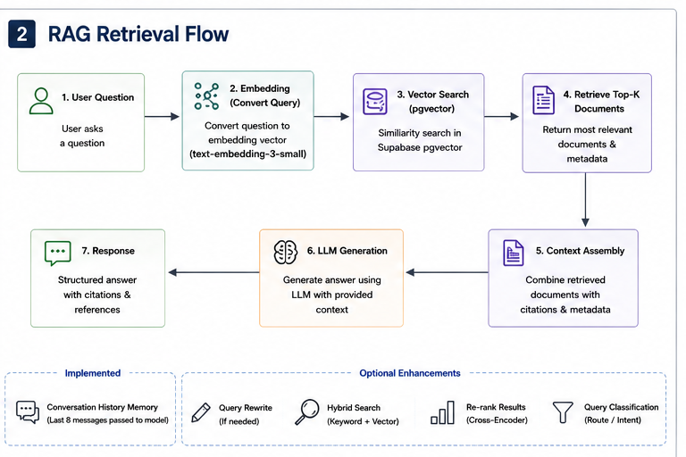
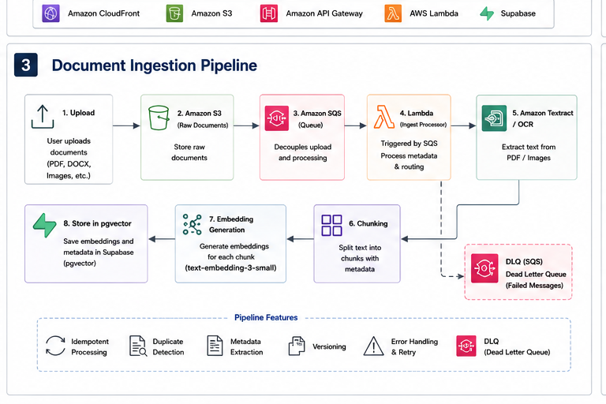
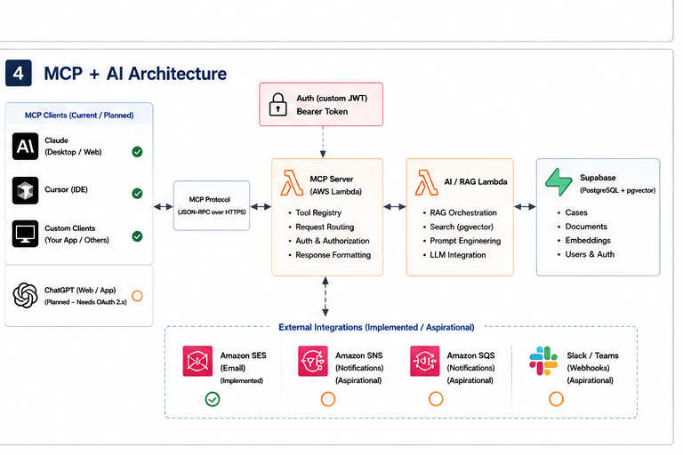

# Architecture

ProBono AI is a legal RAG platform: a static React SPA on CloudFront/S3, an
HTTP API Gateway fronting Lambda services, Supabase (Postgres + pgvector) for
data and embeddings, and OpenAI/Anthropic for generation.

---

## 1. Overall System Architecture

- **Users → CloudFront → S3** serve the static React SPA (the landing page is
  pre-rendered to avoid a client-side-render flash).
- The SPA calls **API Gateway (HTTP API)**, which fronts three Lambdas:
  - **API Lambda** — authentication (custom JWT: bcrypt, Google OAuth, OTP,
    `sub`/`aud`/`iss` claims), case/document APIs, search, user management.
  - **AI / RAG Lambda** — RAG orchestration, retrieval, LLM integration.
  - **MCP Lambda** — MCP endpoints, tool execution, external integrations.
- **S3** stores raw document uploads.
- **Supabase (Postgres + pgvector)** holds cases, documents, embeddings, and users.
- **External LLMs:** OpenAI (`gpt-4o-mini`, `text-embedding-3-small`) and,
  optionally, Anthropic (Claude).

## 2. RAG Retrieval Flow

User question → **embed** (`text-embedding-3-small`) → **vector search** over
Supabase pgvector → **retrieve top-K** legislation, caselaw, and case-document
chunks → **context assembly** with citations → **LLM generation** → structured
response with references.

Conversation history (the last 8 messages) is included in the prompt.
Query rewrite, hybrid search, cross-encoder re-ranking, and query
classification are planned enhancements.

## 3. Document Ingestion Pipeline

**Upload → S3 → SQS → Ingest Lambda → Textract/OCR → chunking → embedding
generation (`text-embedding-3-small`) → store in pgvector (`case_chunks`).**
Failed messages route to a dead-letter queue. Implemented in
`services/ingestion/handler.py`.

## 4. MCP + AI Architecture

MCP clients (Claude, Cursor, custom clients; ChatGPT planned pending OAuth 2.x)
connect over the **MCP protocol (JSON-RPC over HTTPS)** to the **MCP Lambda**
(tool registry, request routing, auth, response formatting), which calls the
**AI / RAG Lambda** and **Supabase**. Authentication uses custom JWT bearer
tokens. External integrations: Amazon SES (email) is implemented; SNS/SQS
notifications and Slack/Teams webhooks are aspirational.
